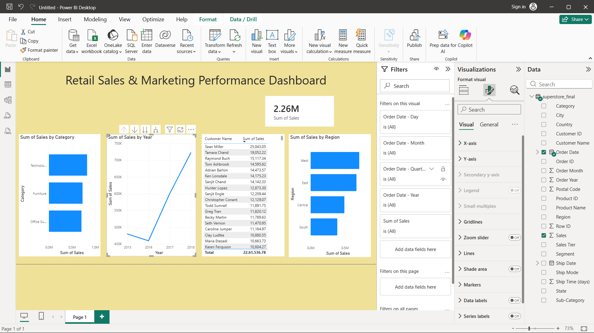

# Retail Sales Analysis | SQL, Excel, Power BI

## Overview
Analyzed 9,800 retail transactions to identify sales trends, top-performing 
products/regions, and customer purchasing patterns. Built an interactive 
Power BI dashboard to visualize key business metrics.

## Tools Used
- Excel (data cleaning, PivotTables)
- SQL / SQLite (data analysis, aggregations, window functions)
- Power BI (interactive dashboard)

## Key Insights
- The West region generated the highest revenue ($710K, ~31% of total sales), 
  while the South region lagged ~45% behind West.
- The Canon imageCLASS 2200 Advanced Copier was the single highest-revenue 
  product ($61.6K), more than double the second-highest product.
- Phones and Chairs were the top-performing sub-categories, each generating 
  over $320K in sales.
- Fasteners was the weakest-performing sub-category at just $3K in total 
  sales, indicating a potential candidate for reduced inventory investment.

## Dashboard

## Files
- `analysis_queries.sql` — SQL queries used for analysis
- `superstore_CLEANED.xlsx` — Cleaned dataset with PivotTables
- `superstore_dashboard.pbix` — Power BI dashboard file
